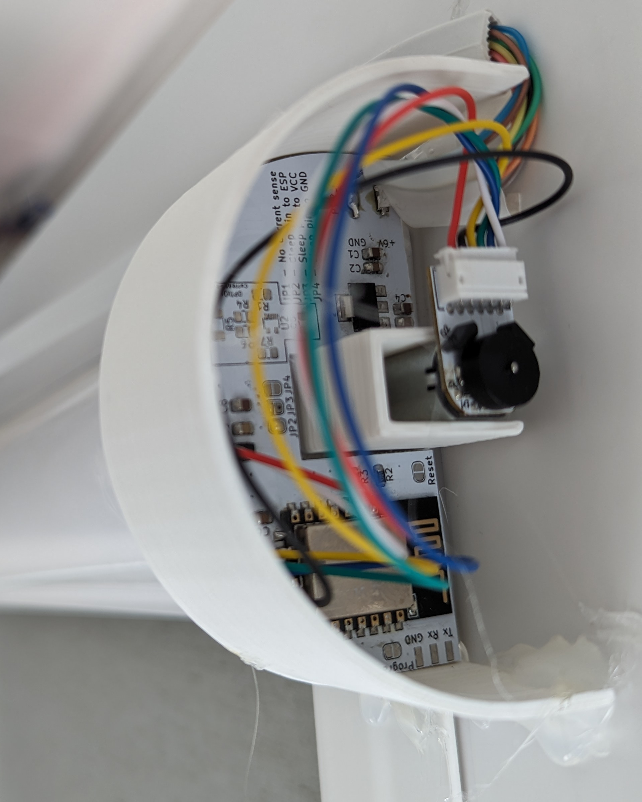

# SmartShades

ESP-12F based project which enables to convert any standard shades into smart shades.

It communicates using mqtt and allows controlling the shades position

### What you need

* ESP-12F - or compatible device
* DRV8220DSG
* motor with encoder
* LM117-3.3
* capacitors and resistors

###

